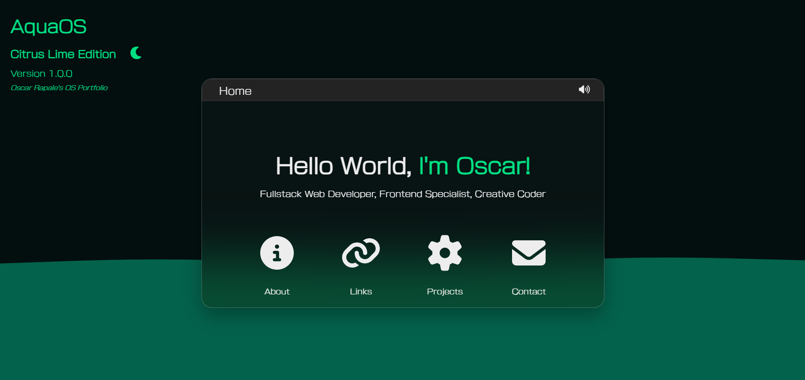

 # 🌊 AquaOS - Interactive Desktop Portfolio

A modern, responsive desktop operating system experience built with **Next.js 15** and **React**. AquaOS showcases my full-stack development skills through an immersive, interactive portfolio that mimics a real desktop environment.



## Features

### Desktop Experience

- **Draggable Windows** - Fully interactive windows with drag-and-drop functionality
- **Theme Switching** - Dynamic light/dark mode with "Cherry Cola" and "Citrus Lime" editions
- **Audio System** - Interactive sound effects with user controls
- **Glassmorphism UI** - Modern frosted glass effects with backdrop filters
- **Animated Background** - Dynamic wave animations using React Wavify

### Mobile Optimized

- **Responsive Design** - Mobile-first approach with iOS-inspired touch interactions
- **Touch-Friendly** - Optimized button sizes and interactions for mobile devices
- **Progressive Enhancement** - Features scale appropriately across all screen sizes

### Technical Features

- **React Portals** - Windows render outside the component tree for proper layering
- **CSS Modules** - Scoped styling with CSS variables for theming
- **Custom Hooks** - Audio management and theme persistence
- **Semantic HTML** - Proper accessibility and SEO optimization
- **Performance Optimized** - Lazy loading and optimized assets

## Live Demo

**[Experience AquaOS](https://www.aqua-os.dev/)**

## Built With

### Frontend

- **Next.js 15** - React framework with App Router
- **React 18** - Modern React with hooks and concurrent features
- **CSS Modules** - Component-scoped styling
- **FontAwesome** - Icon library
- **React Draggable** - Window dragging functionality
- **React Wavify** - Animated wave backgrounds

### Styling & UX

- **CSS Custom Properties** - Dynamic theming system
- **Glassmorphism** - Modern UI design with backdrop filters
- **Responsive Grid/Flexbox** - Mobile-first layout system
- **CSS Animations** - Smooth transitions and hover effects

### Audio & Interactivity

- **use-sound** - Web Audio API integration
- **next-themes** - Theme management system
- **React Portals** - Advanced component rendering

## Project Structure

```
desktop-app/
├── src/
│   ├── app/
│   │   ├── components/
│   │   │   ├── AboutWindow.jsx      # Personal information
│   │   │   ├── ProjectWindow.jsx    # Showcase of projects
│   │   │   ├── ContactWindow.jsx    # Contact information
│   │   │   ├── LinksWindow.jsx      # Social media links
│   │   │   ├── HomeWindow.jsx       # Main desktop interface
│   │   │   └── ThemeToggle.jsx      # Theme switching component
│   │   ├── providers/
│   │   │   └── theme-provider.jsx   # Theme context provider
│   │   ├── fonts/                   # Custom fonts
│   │   ├── globals.css              # Global styles and theme variables
│   │   ├── layout.js                # Root layout with metadata
│   │   └── page.js                  # Home page component
│   └── public/
│       ├── sounds/                  # Audio effects
│       ├── images/                  # Screenshots and assets
│       └── favicon files
```

## Installation & Setup

### Prerequisites

- Node.js 18+
- npm, yarn, or pnpm

### Local Development

1. **Clone the repository**

   ```bash
   git clone https://github.com/OscarRapale/desktop-os.git
   cd aquaos-portfolio
   ```

2. **Install dependencies**

   ```bash
   npm install
   # or
   yarn install
   # or
   pnpm install
   ```

3. **Run the development server**

   ```bash
   npm run dev
   # or
   yarn dev
   # or
   pnpm dev
   ```

4. **Open your browser**
   Navigate to [http://localhost:3000](http://localhost:3000)

### Production Build

```bash
npm run build
npm run start
```

## How to Use

1. **Home Screen**: Click on the desktop icons to open different windows
2. **About**: Learn about my background and skills
3. **Projects**: Explore my development projects and technologies
4. **Contact**: Get in touch through various channels
5. **Links**: Access my social media and professional profiles
6. **Theme Toggle**: Switch between light and dark themes
7. **Audio**: Toggle sound effects on/off

### Desktop Features

- **Drag Windows**: Grab any window by its title bar to move it around
- **Responsive Layout**: Resize your browser to see mobile adaptations
- **Multi-Window**: Open multiple windows simultaneously

## Customization

### Theme Colors

Modify theme colors in `src/app/globals.css`:

```css
:root {
  --accent-color: #e0090c; /* Cherry Cola red */
  --wave-color: #9a0002;
  /* ... other variables */
}

.dark {
  --accent-color: #00df82; /* Citrus Lime green */
  --wave-color: #03624c;
  /* ... other variables */
}
```

### Audio Effects

Replace audio files in `public/sounds/` to customize sound effects.

### Window Content

Each window component is modular - easily add new windows or modify existing ones in the `components/` directory.

## SEO & Performance

- **Metadata Optimization** - Complete Open Graph and Twitter Cards
- **Structured Data** - Schema.org markup for better search visibility
- **Semantic HTML** - Proper heading hierarchy and ARIA labels
- **Image Optimization** - Next.js automatic image optimization
- **Progressive Loading** - Optimized bundle splitting

## Browser Support

- ✅ Chrome/Chromium 90+
- ✅ Firefox 88+
- ✅ Safari 14+
- ✅ Edge 90+
- ✅ Mobile browsers (iOS Safari, Chrome Mobile)

## License

This project is open source and available under the [MIT License](LICENSE).

## About Me

**Oscar Rapale Méndez**  
_Fullstack Web Developer | Frontend Specialist | Creative Coder_

🏠 Puerto Rico  
🎓 Holberton School Graduate  
💼 Specializing in React, Next.js, and modern web technologies

### Connect With Me

- **Portfolio**: [aqua-os.dev](https://www.aqua-os.dev/)
- **LinkedIn**: [linkedin.com/in/oscar-rapale](https://linkedin.com/in/oscar-rapale)
- **GitHub**: [github.com/OscarRapale](https://github.com/OscarRapale)

---

## Acknowledgments

- **Next.js Team** - For the amazing React framework
- **React Community** - For the incredible ecosystem
- **Holberton School** - For the solid foundation in software engineering
- **Open Source Community** - For the tools that made this possible

---

<div align="center">

**If you found this project interesting, please give it a star!**

Made with ❤️ by Oscar Rapale

</div>
